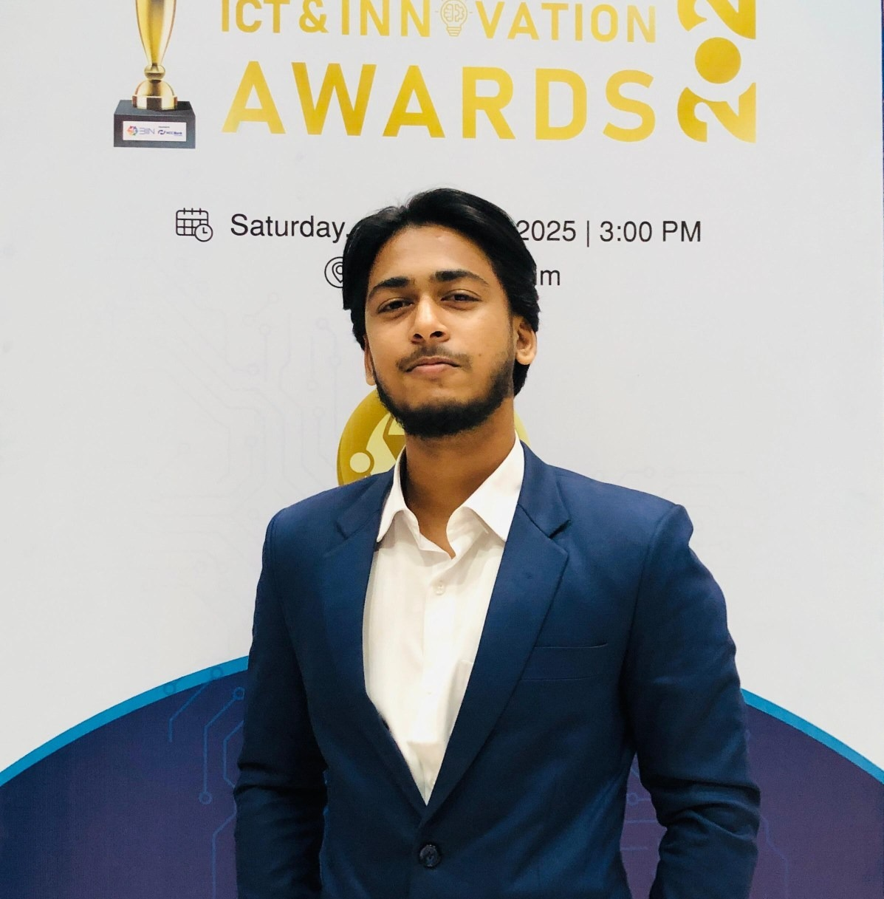

<div align="center">
  
  <h1>🏎️ Team Durnibar — WRO 2026 Future Engineers</h1>
  <p><strong>Official Repository & Technical Documentation for World Robot Olympiad 2026 (Self-Driving Cars)</strong></p>
  <p>Representing <strong>Bangladesh 🇧🇩</strong></p>

  [](https://wro-association.org/)
  [](https://wro-association.org/wp-content/uploads/WRO-2026-Future-Engineers-Self-Driving-Cars-General-Rules.pdf)
  [](./LICENSE)
</div>

---

## 📌 Table of Contents

- [1. Team Introduction](#1-team-introduction)
- [2. Mission & WRO 2026 Rules Overview](#2-mission--wro-2026-rules-overview)
- [3. Vehicle System Architecture](#3-vehicle-system-architecture)
- [4. Repository Folder Hierarchy](#4-repository-folder-hierarchy)
- [5. Mechanical & Kinematic Design](#5-mechanical--kinematic-design)
- [6. Power & Sensor Management](#6-power--sensor-management)
- [7. Software Modules & Algorithm Strategy](#7-software-modules--algorithm-strategy)
- [8. Hardware Components & Bill of Materials](#8-hardware-components--bill-of-materials)
- [9. Build, Compilation & Upload Instructions](#9-build-compilation--upload-instructions)
- [10. Autonomous Demonstration Videos](#10-autonomous-demonstration-videos)
- [11. Judging Criteria & Documentation Index](#11-judging-criteria--documentation-index)

---

## 1. Team Introduction

**Team Durnibar** is a collegiate robotics team from Bangladesh competing in the **Future Engineers** category at the **World Robot Olympiad (WRO) 2026**.

<table align="center">
  <tr>
    <td align="center" width="33%">
      <br><br>
      <strong>Azmain Shak Rubayed</strong><br>
      <sub>Team Lead / CAD & Vision Systems</sub><br>
      <sub>Fusion 360, ROS 2, OpenCV, Python</sub><br>
      <a href="mailto:rubayed_41220200226@nub.ac.bd">✉️ Email</a>
    </td>
    <td align="center" width="33%">
      <br><br>
      <strong>Rifat Ahmmed</strong><br>
      <sub>Embedded Software & Control</sub><br>
      <sub>Independent University Bangladesh</sub><br>
      <a href="mailto:ra7260352@email.com">✉️ Email</a>
    </td>
    <td align="center" width="33%">
      <br><br>
      <strong>Tanvir Ahmed</strong><br>
      <sub>Electronics & Hardware Integration</sub><br>
      <sub>Barishal Polytechnic Institute</sub><br>
      <a href="mailto:member3@email.com">✉️ Email</a>
    </td>
  </tr>
</table>

---

## 2. Mission & WRO 2026 Rules Overview

The **WRO 2026 Future Engineers Self-Driving Cars** category challenges teams to engineer an autonomous 4-wheeled robotic vehicle capable of high-speed navigation, obstacle traffic sign obedience, and autonomous parallel parking on a randomly configured racetrack.

```
+-----------------------------------------------------------------------------------+
|                        WRO 2026 COMPETITION CHALLENGES                            |
+-----------------------------------------------------------------------------------+
|  1. Open Challenge:                                                               |
|     • Complete 3 laps on a track with random inner wall configurations.            |
|     • Variable corridor widths (600 mm or 1000 mm).                               |
|     • Autonomous complete stop inside the finish section after 3 laps.            |
|                                                                                   |
|  2. Obstacle Challenge:                                                           |
|     • Complete 3 laps obeying traffic signs (Red Pillars = Keep RIGHT,            |
|       Green Pillars = Keep LEFT).                                                 |
|     • Complete autonomous parallel parking in designated 20 cm wide parking lot.  |
+-----------------------------------------------------------------------------------+
```

### Key Technical Rule Compliance Checklist (WRO 2026 Rules)
- **Rule 11.1 & 11.2**: Max dimensions $300 \text{ mm (L)} \times 200 \text{ mm (W)} \times 300 \text{ mm (H)}$, max weight $1.5 \text{ kg}$.
- **Rule 11.3 & 11.13**: 4-wheeled vehicle with **one single driving axle** connected via gearbox and **one steering actuator**. Differential drive (skid steering) and independent side motors are strictly prohibited.
- **Rule 9.10 & 9.11**: Vehicle power activated by **exactly one main switch**; program execution triggered by **exactly one start button**.
- **Rule 11.10**: Strictly 100% autonomous operation — no RF, Bluetooth, Wi-Fi, or remote communication during competition attempts.

---

## 3. Vehicle System Architecture

**Durnibar 2.0** uses a decoupled two-tier architecture balancing high-level computer vision processing with real-time microcontroller actuator response:

```
┌─────────────────────────────────────────────────────────────────────────┐
│                     HIGH-LEVEL COMPUTATION (SBC)                        │
│   • Raspberry Pi 4B (ROS 2 / Python)                                    │
│   • Wide-Angle USB Camera (Color Pillar Detection & Lane Tracking)      │
│   • Finite State Machine (FSM) Decision Engine                          │
└────────────────────────────────────┬────────────────────────────────────┘
                                     │ High-Speed UART (115200 Baud)
┌────────────────────────────────────▼────────────────────────────────────┐
│                    LOW-LEVEL CONTROLLER (ESP32 MCU)                     │
│   • 4x VL53L1X Time-of-Flight (ToF) Distance Array                      │
│   • BNO055 9-DOF Inertial Measurement Unit (IMU)                        │
│   • Closed-Loop Steering PID & PWM Motor ESC Drivers                    │
└─────────────────────────────────────────────────────────────────────────┘
```

---

## 4. Repository Folder Hierarchy

Our repository is organized to follow GitHub engineering best practices and WRO Appendix C reproducibility standards:

```
d:\Durnibar 26\
├── README.md                           # Main landing page & technical summary
├── LICENSE                             # MIT Open Source License
├── docs/                               # Detailed Technical Documentation (Appendix C)
│   ├── README.md                       # Documentation Index
│   ├── 01_mobility_and_mechanics.md    # Criterion 1: Ackermann steering, gear ratio, torque calculations
│   ├── 02_power_and_sensors.md         # Criterion 2: Power budget, wiring map, ToF & IMU placement
│   ├── 03_software_and_obstacle.md     # Criterion 3: ROS 2 nodes, FSM state machine, CV, parking logic
│   ├── 04_systems_thinking_decisions.md# Criterion 4: Trade-off analysis, constraints, FMECA matrix
│   └── 05_reproducibility_guide.md     # Criterion 5: Complete BOM, step-by-step build & flash guide
├── journal/                            # Engineering Journal & Testing Records
│   ├── README.md                       # Journal overview
│   └── testing_logs.md                 # Practice lap metrics, PID tuning, parking success rates
├── src/                                # Modular Robot Source Code
│   ├── README.md                       # Source code index & dependency setup
│   ├── main_node/                      # High-level FSM & state coordinator
│   ├── vision/                         # OpenCV color pillar detection & lane segmentation
│   ├── navigation/                     # Steering PID controller & parallel parking engine
│   └── firmware/                       # ESP32 MCU C++/Arduino firmware
├── models/                             # 3D CAD Designs & Print Files
│   ├── README.md                       # Model directory index
│   ├── cad_source/                     # Fusion 360 source models (Durnibar 2.0.f3z, Gear Box v2.0.f3d)
│   └── 3d_print_files/                 # Printable STL / STEP files
├── schematics/                         # Electrical Layout & Pinouts
│   ├── README.md                       # ESP32 pinout table & electrical specs
│   └── wiring_diagram.png              # System power & signal wiring map
├── assets/                             # Images & Media
│   ├── Banner_Durnibar.png             # Team banner
│   ├── team/                           # Member profile photos
│   └── vehicle/                        # Vehicle photos (Front, Back, Left, Right, Top, Bottom)
└── videos/                             # Autonomous Driving Demonstrations
    └── README.md                       # YouTube links for Open & Obstacle Challenge (>30s runs)
```

---

## 5. Mechanical & Kinematic Design

Per **Criterion 1 (Mobility & Mechanical Design)**, Durnibar 2.0 uses **Ackermann Steering Kinematics** combined with a custom **24:1 two-stage spur gearbox transmission** driven by a single rear axle:

### Ackermann Steering Equation
$$\cot(\delta_o) - \cot(\delta_i) = \frac{W}{L}$$

Where $W = 145 \text{ mm}$ (track width) and $L = 175 \text{ mm}$ (wheelbase). This ensures all four wheels rotate around a single Instantaneous Center of Rotation (ICR), preventing tire slippage on narrow turns.

For complete mechanical equations, torque calculations, and CAD iteration history, see **[docs/01_mobility_and_mechanics.md](./docs/01_mobility_and_mechanics.md)**.

---

## 6. Power & Sensor Management

Per **Criterion 2 (Power & Sensor Architecture)**, power is delivered by a **3S 11.1V 2200mAh LiPo battery** through isolated power rails:
- **High-Current Rail ($11.1\text{ V}$)**: Powers the rear brushless drive motor ESC directly.
- **Regulated Power Rail ($5.0\text{ V} / 5\text{ A}$)**: High-efficiency buck regulator supplying the Raspberry Pi 4B, ESP32 MCU, camera, ToF sensors, and IMU.

### System Power Budget Table

| Component Category | Devices | Total Nominal Power | Peak Current |
| :--- | :--- | :---: | :---: |
| **Compute & Vision** | Raspberry Pi 4B + USB Camera | $7.25 \text{ W}$ | $2.90 \text{ A}$ |
| **Sensing & Logic** | ESP32 MCU + 4x ToF + IMU | $0.83 \text{ W}$ | $0.51 \text{ A}$ |
| **Actuators & Motors** | Steering Servo + ESC Drive Motor | $18.45 \text{ W}$ | $7.30 \text{ A}$ |
| **Total System Load** | — | **$26.53 \text{ W}$** | **$10.71 \text{ A}$** |

For complete electrical schematics, pinouts, and sensor placement geometry, see **[docs/02_power_and_sensors.md](./docs/02_power_and_sensors.md)**.

---

## 7. Software Modules & Algorithm Strategy

Per **Criterion 3 (Software Architecture & Obstacle Strategy)**, software modules are decoupled into clean ROS 2 packages:

1. **Vision Module (`src/vision/`)**: Uses HSV color segmentation and adaptive thresholding to detect traffic sign pillars (Red = Pass Right, Green = Pass Left).
2. **Navigation Module (`src/navigation/`)**: Computes PID steering adjustments ($\delta = K_p e + K_i \int e + K_d \dot{e}$) to keep the vehicle centered in the track corridor.
3. **Parking Engine (`src/navigation/`)**: Detects the $20\text{ cm}$ parking lot gap using side ToF sensors and executes a two-phase reverse parallel parking sequence.

For complete FSM diagrams, vision pseudocode, and PID parameter tuning, see **[docs/03_software_and_obstacle.md](./docs/03_software_and_obstacle.md)**.

---

## 8. Hardware Components & Bill of Materials

Per **Criterion 5 (Reproducibility)**, below is the core hardware inventory:

| Component | Function / Role | Model / Part | Approx. Price |
| :--- | :--- | :--- | :---: |
| **Main SBC** | High-level vision & FSM | Raspberry Pi 4B (4GB) | $55.00 |
| **Microcontroller** | Low-level PWM & sensor reading | ESP32 NodeMCU | $6.00 |
| **Camera** | Color traffic sign recognition | Wide-Angle USB Camera 1080p | $18.00 |
| **Distance Array** | Wall distance measurement | 4x VL53L1X ToF Sensors | $18.00 |
| **IMU** | Heading & orientation tracking | BNO055 9-DOF IMU | $14.00 |
| **Steering Servo** | Front wheel Ackermann control | Metal Gear Digital Servo | $12.00 |
| **Drive Motor** | Propulsion via 24:1 transmission | Brushless DC Motor + ESC | $22.00 |
| **Power Source** | Main vehicle battery | 3S 11.1V 2200mAh LiPo | $16.00 |

For full assembly guide and parts links, see **[docs/05_reproducibility_guide.md](./docs/05_reproducibility_guide.md)**.

---

## 9. Build, Compilation & Upload Instructions

### ROS 2 High-Level Environment Setup
```bash
# 1. Source ROS 2 environment
source /opt/ros/humble/setup.bash

# 2. Build workspace
cd ~/ros2_ws
colcon build --symlink-install --packages-select durnibar_vision durnibar_nav durnibar_fsm

# 3. Launch main robot controller node
ros2 launch durnibar_fsm robot_launch.py
```

### Microcontroller Firmware Upload (ESP32)
```bash
# Flash ESP32 firmware via PlatformIO
cd src/firmware
pio run --target upload --upload-port /dev/ttyUSB0
```

---

## 10. Autonomous Demonstration Videos

Per **Rule Section 7**, public YouTube video links demonstrating autonomous vehicle operation (>30 seconds per attempt) are available below:

- 📺 **[Open Challenge Autonomous Run](https://youtube.com/@YOUR_CHANNEL)** — Complete 3-lap run with autonomous finish section stop.
- 📺 **[Obstacle Challenge Autonomous Run](https://youtube.com/@YOUR_CHANNEL)** — Complete 3-lap run with traffic sign obedience and parallel parking.

See **[videos/README.md](./videos/README.md)** for detailed video logs.

---

## 11. Judging Criteria & Documentation Index

Our technical documentation directly maps to the **WRO 2026 Appendix C Scoring Rubric (30 Points Total)**:

- 📗 **[Criterion 1: Mobility & Mechanical Design (6 pts)](./docs/01_mobility_and_mechanics.md)**
- 📘 **[Criterion 2: Power & Sensor Architecture (6 pts)](./docs/02_power_and_sensors.md)**
- 📙 **[Criterion 3: Software Architecture & Obstacle Strategy (6 pts)](./docs/03_software_and_obstacle.md)**
- 📕 **[Criterion 4: Systems Thinking & Engineering Decisions (6 pts)](./docs/04_systems_thinking_decisions.md)**
- 📓 **[Criterion 5: Reproducibility & GitHub Quality (6 pts)](./docs/05_reproducibility_guide.md)**
- 📑 **[Engineering Journal & Practice Logs](./journal/testing_logs.md)**

---

<div align="center">
  <sub>Developed with ❤️ by <strong>Team Durnibar</strong> for <strong>WRO 2026 Future Engineers</strong></sub>
</div>
