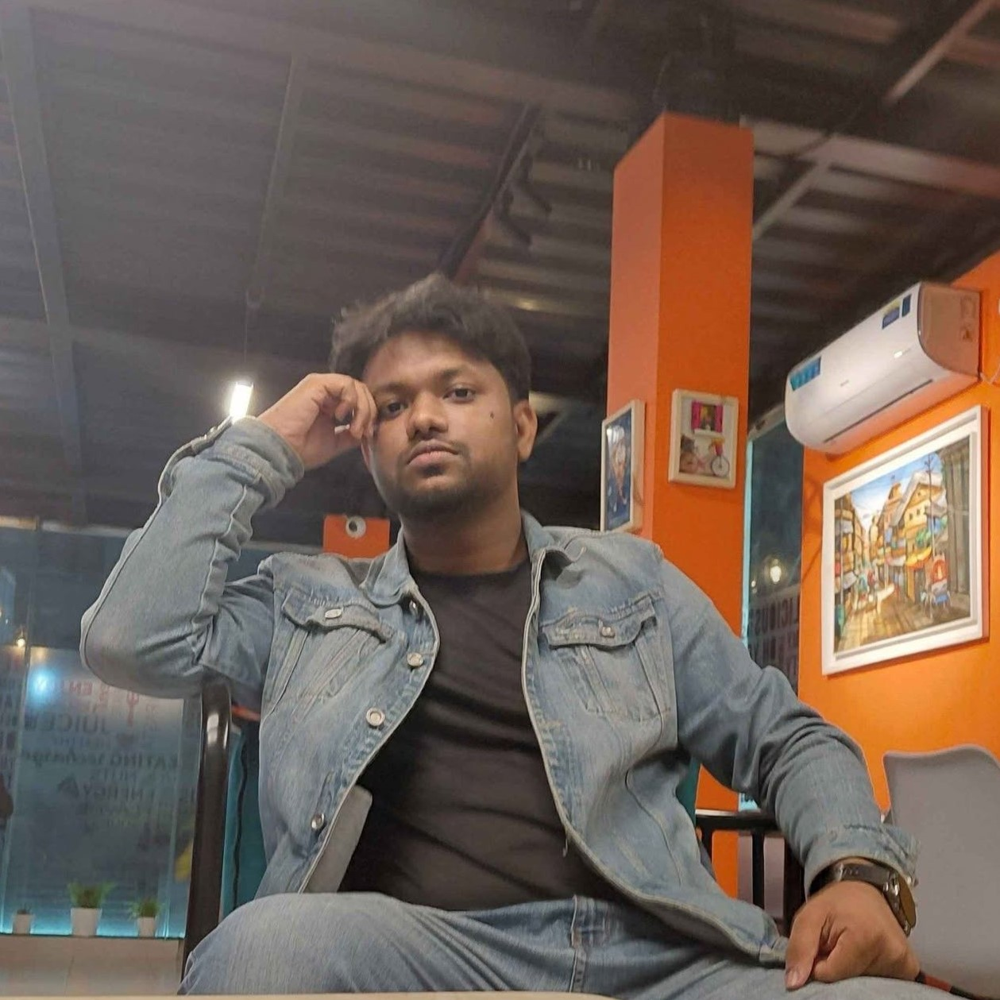

  <!-- Replace with your team banner image -->
  

  <strong>Team Durnibar</strong> is a robotics team from <strong>Bangladesh</strong>.
  <!-- Add your team's background, formation year, and any notable achievements -->
  Formed in 2026 January, Durnibar competes in the <strong>Future Engineers</strong> category of the <strong>World Robot Olympiad 2026</strong>.

 

We named our robot **[Robot Name]**, built for the **Future Engineers** category in **WRO 2025**.

> This repository contains all files, code, models, photos, and documentation about our team and robot.

Visit our team socials:

---

## Table of Contents

- [`Team Introduction`](#team-introduction)
- [`Mission Overview`](#mission-overview-for-wro-future-engineers-rounds)
- [`Repository Structure`](#repository)
- [`Key Features`](#key-features)
- [`Components and Hardware`](#components-and-hardware)
- [`Algorithm and Software`](#algorithm-and-software)
- [`Mobility Management`](#mobility-management)
- [`Power and Sense Management`](#power-and-sense-management)

---

## Team Introduction

  
   
  <strong>[Azmain Shak Rubayed]</strong> 
  [Role — Team Lead, 3D Modeling, Software & Computer Vision] 
  [Fusion360, ROS2, OpneCV, Python] 
  <a href="mailto:member1@email.com">rubayed_41220200226@nub.ac.bd</a>

     

---

  
  

  <strong>[Rifat Ahmmed]</strong> 
  [Role - ROS2, Microcontroller] 
  [Independent University Bangladesh, Department of Electronics & Electrical Engineering] 
  <a href="mailto:member2@email.com">ra7260352@email.com</a>
  

     

---

  
  <strong>[Tanvir Ahmed]</strong> 
  [Role - Electronics ] 
  [Barishal Politecnic Institute, Department of Electronics & Electrical Engineering ] 
  <a href="mailto:member3@email.com">member3@email.com</a>

     

---

## Mission Overview for WRO Future Engineers Rounds

<table>
  <tr>
    <td width="50%" valign="top" align="center"><h3>🏁 Round 1: Lap Completion</h3></td>
    <td width="50%" valign="top" align="center"><h3>🏆 Round 2: Obstacle Avoidance & Parking</h3></td>
  </tr>
  <tr>
    <td width="50%" valign="top" align="left">
      
In <strong>Round 1</strong>, the robot must autonomously complete <strong>three laps</strong> on a pre-defined track, demonstrating stable navigation and precise lap tracking.

      <ul>
        <li><strong>Objective</strong>: Complete three laps within the allotted time.</li>
        <li><strong>Key Tasks</strong>: Accurate path-following, speed control, and lap counting.</li>
      </ul>
      <!-- Add your Round 1 track image below -->
      
 
        
      

    </td>
    <td width="50%" valign="top" align="left">
      
In <strong>Round 2</strong>, the robot must complete <strong>three laps</strong> while avoiding colored obstacles:

      <ul>
        <li><strong>Green Obstacles</strong>: Robot moves <strong>left</strong>.</li>
        <li><strong>Red Obstacles</strong>: Robot moves <strong>right</strong>.</li>
      </ul>
      
After completing the laps, the robot must park in a designated zone.

      <ul>
        <li><strong>Objective</strong>: Complete laps, avoid obstacles, and park precisely.</li>
        <li><strong>Tasks</strong>: Obstacle detection, color-based avoidance, precision parking.</li>
      </ul>
      <!-- Add your Round 2 track image below -->
      

        
      

    </td>
  </tr>
</table>

---

> [!IMPORTANT]
> **WRO Future Engineers Rulebook**
> - Read the **WRO Future Engineers 2025 Rulebook** thoroughly before proceeding.
> - Official link: [🔗 WRO Future Engineers 2025 Rulebook](https://wro-association.org/wp-content/uploads/WRO-2025-Future-Engineers-Self-Driving-Cars-General-Rules.pdf)

---

## Repository

This repository includes all files, designs, and code for our WRO 2025 robot.

### File Structure

- **[`assets`](./assets/)** — Images used across the README files.
- **[`instructions`](./instructions/)** — Setup and usage instructions.
- **[`models`](./models/)** — 3D models and CAD designs.
- **[`src`](./src/)** — Robot source code (ROS2 packages).
- **[`t-photos`](./t-photos/)** — Technical build images.
- **[`v-photos`](./v-photos/)** — Visual/showcase photos.
- **[`video`](./video/)** — Performance and demo videos.

---

## Key Features

- **`[Feature 1 Name]`**: [Describe what makes this feature unique or notable for your robot.]
- **`[Feature 2 Name]`**: [e.g., Advanced Sensor Suite — what sensors you use and why.]
- **`[Feature 3 Name]`**: [e.g., ROS2 Integration — why you chose ROS2 and what it enables.]
- **`[Feature 4 Name]`**: [e.g., Real-Time Odometry — how position is tracked accurately.]
- **`[Feature 5 Name]`**: [e.g., Efficient Debugging — what tools/displays help with debugging.]

---

## Components and Hardware

<table>
  <thead>
    <tr>
      <th>Image</th>
      <th>Component</th>
      <th>Price</th>
      <th>Role / Function</th>
      <th>Mounting</th>
    </tr>
  </thead>
  <tbody>
    <tr>
      <td>

</td>
      <td><a href="PURCHASE_LINK">[Main Compute Board]</a></td>
      <td>$XX.XX</td>
      <td>[What it does — e.g., High-level processing, vision, sensor integration.]</td>
      <td>[How it's physically mounted on the robot.]</td>
    </tr>
    <tr>
      <td>

</td>
      <td><a href="PURCHASE_LINK">[LiDAR / Distance Sensor]</a></td>
      <td>$XX.XX</td>
      <td>[360° scanning, obstacle detection, etc.]</td>
      <td>[Mounting detail.]</td>
    </tr>
    <tr>
      <td>

</td>
      <td><a href="PURCHASE_LINK">[Camera]</a></td>
      <td>$XX.XX</td>
      <td>[Color detection, vision tasks.]</td>
      <td>[Mounting detail.]</td>
    </tr>
    <tr>
      <td>

</td>
      <td><a href="PURCHASE_LINK">[Microcontroller]</a></td>
      <td>$XX.XX</td>
      <td>[Low-level control: motors, servos, sensors.]</td>
      <td>[Mounting detail.]</td>
    </tr>
    <tr>
      <td>

</td>
      <td><a href="PURCHASE_LINK">[IMU / Orientation Sensor]</a></td>
      <td>$XX.XX</td>
      <td>[Orientation tracking, heading for odometry.]</td>
      <td>[Mounting detail.]</td>
    </tr>
    <tr>
      <td>

</td>
      <td><a href="PURCHASE_LINK">[Motor + Encoder]</a></td>
      <td>$XX.XX</td>
      <td>[Drive torque + position feedback.]</td>
      <td>[Mounting detail.]</td>
    </tr>
    <tr>
      <td>

</td>
      <td><a href="PURCHASE_LINK">[Motor Driver]</a></td>
      <td>$XX.XX</td>
      <td>[PWM motor control with current protection.]</td>
      <td>[Mounting detail.]</td>
    </tr>
    <tr>
      <td>

</td>
      <td><a href="PURCHASE_LINK">[Servo Motor]</a></td>
      <td>$XX.XX</td>
      <td>[Steering actuation and/or camera positioning.]</td>
      <td>[Mounting detail.]</td>
    </tr>
    <tr>
      <td>

</td>
      <td><a href="PURCHASE_LINK">[Buck Converter(s)]</a></td>
      <td>$XX.XX</td>
      <td>[Voltage regulation for specific subsystems.]</td>
      <td>[Mounting detail.]</td>
    </tr>
    <!-- Add more rows as needed -->
  </tbody>
</table>

> More details on power and sensing components are covered in the sections below.

---

## Algorithm and Software

[Give a brief high-level summary of your software architecture. Mention key algorithms, frameworks (e.g., ROS2), and unique approaches your team developed.]

> [**More details on software are in the `/src` directory.**](/src/)

### Key Algorithms

#### [Algorithm 1 Name]
[Describe how this algorithm works and why you chose this approach.]

#### [Algorithm 2 Name]
[Describe how this algorithm works and why you chose this approach.]

#### [Algorithm 3 Name]
[Describe how this algorithm works and why you chose this approach.]

---

## Mobility Management

### Chassis Design

[Describe your chassis — how many layers, what's on each layer, materials used, and the CAD tool you used.]

1. **First / Bottom Layer:**
   - [What's mounted here and why.]
2. **Second / Middle Layer:**
   - [What's mounted here and why.]
3. **Top Layer / Cover:**
   - [What's mounted here and why.]

#### Step-by-step Assembly
[Brief assembly order — bottom up, noting key connection points and wiring milestones.]

---

### Drive Motor

[Describe your chosen motor — type, torque, encoder specs, and why you selected it over alternatives.]

---

### Servo Selection

[Describe your servo — model, specs (speed, torque), availability, and why it suits your robot.]

---

### Drive System

<table>
<tr>
<td width="50%">

#### How It Works
- [Explain your drivetrain — differential, direct drive, belt drive, etc.]
- [Describe the gear ratio and how torque is transferred.]
- [How encoders interact with the drive system.]

#### Benefits
1. [Benefit 1]
2. [Benefit 2]
3. [Benefit 3]

<!-- Add your drive system diagram image below -->

  

</td>
<td width="50%">

  <!-- Add a photo of your actual drivetrain -->
  

</td>
</tr>
</table>

---

### Steering System

[Describe your steering mechanism — Ackermann, simple pivot, etc. — and how the servo is connected.]

#### Advantages
1. [Advantage 1]
2. [Advantage 2]
3. [Advantage 3]

<!-- Add your steering system image below -->

  

---

## Power and Sense Management

[Brief overview of your power architecture — battery type, how you've split power rails, and why.]

<!-- Add your PCB schematic image below -->

  

---

### Power Components

#### 1. Battery
- **Type**: [e.g., 3S LiPo]
- **Voltage**: [e.g., 11.1V nominal / 12.6V fully charged]
- **Reason for choice**: [High energy density, availability, etc.]

#### 2. [Converter / Regulator 1]
- **Purpose**: [What it powers]
- **Input / Output**: [Voltage in → Voltage out]
- **Why chosen**: [Key reason]

#### 3. [Converter / Regulator 2]
- **Purpose**: [What it powers]
- **Input / Output**: [Voltage in → Voltage out]
- **Why chosen**: [Key reason]

#### 4. Motor Driver
- **Purpose**: [Drive motor control]
- **Features**: [Key specs — current rating, protection features, etc.]

---

### Voltage Distribution Table

| Component | Voltage | Power Source |
|-----------|---------|--------------|
| [Component 1] | [X]V | [Source] |
| [Component 2] | [X]V | [Source] |
| [Component 3] | [X]V | [Source] |
| [Motors] | Battery Voltage | [Driver] |

<!-- Add your power flowchart image below -->

  

---

### PCB Design

[Describe how your PCB was designed and manufactured — tools used, process, any local constraints you faced.]

| **PCB Top View** | **PCB Bottom View** |
|------------------|----------------------|
|  |  |

---

Thank you for reading our documentation! Reach out to us through our socials:

- [Facebook](https://www.facebook.com/YOUR_PAGE)
- [LinkedIn](https://www.linkedin.com/company/YOUR_PAGE)
- [YouTube](https://youtube.com/@YOUR_CHANNEL)
