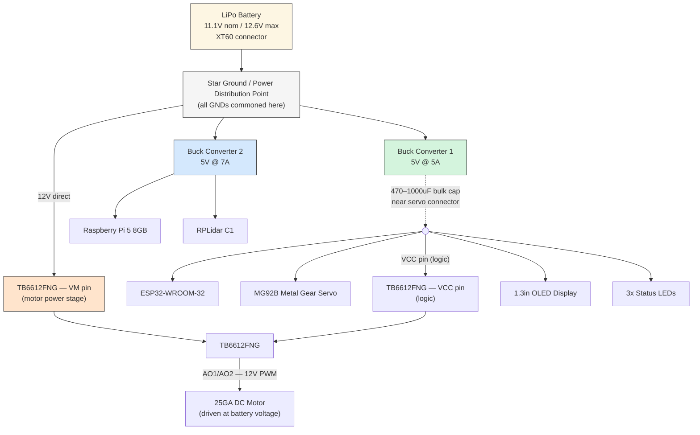

# Criterion 1: Mobility and Mechanical Design

> **WRO 2026 Future Engineers — Technical Report**  
> **Team Durnibar | Bangladesh**

---

## Table of Contents
1. [Quick Reference Specifications](#1-quick-reference-specifications)
2. [Regulatory Compliance](#2-regulatory-compliance)
3. [Steering System — Ackermann Mechanism](#3-steering-system--ackermann-mechanism)
4. [Drivetrain — Motor & Gear Reduction](#4-drivetrain--motor--gear-reduction)
5. [Chassis Architecture & Materials](#5-chassis-architecture--materials)
6. [Design Iteration History](#6-design-iteration-history)
7. [Power Distribution System](#7-power-distribution-system)
   - [7.1 Power Architecture](#71-power-architecture)
   - [7.2 Current Consumption Calculation](#72-current-consumption-calculation)
   - [7.3 Battery Runtime Estimation](#73-battery-runtime-estimation)
   - [7.4 ESP32 Microcontroller GPIO Pin Configuration](#74-esp32-microcontroller-gpio-pin-configuration)
8. [Electronic Components List](#8-electronic-components-list)

---

## 1. Quick Reference Specifications

| Parameter | Value |
|---|---|
| Overall dimensions | 300 mm (L) × 200 mm (W) × 300 mm (H) max |
| Mass | ≤ 1.5 kg |
| Drive configuration | Single driving axle (rear) |
| Steering mechanism | Ackermann steering, single actuator |
| Wheelbase ($L$) | 175 mm |
| Track width ($W$) | 145 mm |
| Wheel diameter ($D$) | 65 mm |
| Motor | High-torque Brushed DC, 8,500 RPM @ 11.1V |
| Gear reduction | 24:1 (2-stage: 1:4 → 1:6) |
| Target top speed | 1.2 m/s |
| Achieved output speed | 1.16 m/s |
| Chassis | Dual-deck — Carbon fiber/acrylic (lower) + PETG 3D print (upper) |

---

## 2. Regulatory Compliance

Per **Section 11 of the WRO 2026 Future Engineers General Rules**, the vehicle satisfies all dimensional and kinematic requirements:

| Rule | Requirement | Compliance |
|---|---|---|
| Dimensions | ≤ $300 \times 200 \times 300\text{ mm}$ ($L \times W \times H$) | ✅ Within limit |
| Mass | ≤ $1.5\text{ kg}$ | ✅ Within limit |
| Drive kinematics (11.3) | 4-wheeled, one driving axle (front/rear/4WD), one steering actuator | ✅ Rear-driven, single steering servo |
| Prohibited systems (11.4 & 11.5) | No differential/skid steering, omni wheels, ball casters, or independent-side-motor electronic differentials | ✅ None used |

---

## 3. Steering System — Ackermann Mechanism

To achieve smooth cornering without tire scrub on the narrow **600–1000 mm** track corridors, **Team Durnibar** implemented an **Ackermann steering mechanism**.

```
         ┌────────────────────────┐
         │       Front Axle       │
  Wheel  │   o─────────o          │  Wheel
 ┌─────┐ │  /           \         │ ┌─────┐
 │     │─┼─o   Steering   o───────┼─│     │
 └─────┘ │  \    Tie-Rod /        │ └─────┘
         │   └───o───o──┘         │
         │       │   │            │
         │    Servo Lever         │
         └────────────────────────┘
```

### Ackermann Geometry Calculations
For a wheelbase $L = 175\text{ mm}$ and track width $W = 145\text{ mm}$, the inner ($\delta_i$) and outer ($\delta_o$) wheel angles during a turn of radius $R$ satisfy the following equations:

$$\cot(\delta_o) - \cot(\delta_i) = \frac{W}{L}$$

$$\delta_o = \arctan\left(\frac{L}{\dfrac{L}{\tan(\delta_i)} + W}\right)$$

This layout keeps all four wheels tracing concentric circles around a common **Instantaneous Center of Rotation (ICR)**, eliminating sideways tire drag and power loss during high-speed cornering maneuvers.

---

## 4. Drivetrain — Motor & Gear Reduction

The drive system uses a single high-torque DC motor coupled to the rear axle through a custom **2-stage spur gear transmission**, designed in Fusion 360 ([`Gear Box v2.0.f3d`](file:///d:/Durnibar26/models/cad_source/Gear%20Box%20v2.0.f3d)).

### 4.1 Design Targets

| Quantity | Value |
|---|---|
| Motor rated speed | 8,500 RPM @ 11.1V |
| Target robot top speed | 1.2 m/s (matched to 30 FPS vision processing latency) |
| Wheel diameter $D$ | 65 mm → circumference $C = \pi D = 0.2042\text{ m}$ |

### 4.2 Gear Ratio Derivation

**Step 1 — Required wheel RPM** for target speed:
$$N_{wheel} = \frac{v}{C} \times 60 = \frac{1.2}{0.2042} \times 60 \approx 352.6 \text{ RPM}$$

**Step 2 — Required total reduction ratio:**
$$i_{total} = \frac{N_{motor}}{N_{wheel}} = \frac{8500}{352.6} \approx 24.1 : 1$$

**Selected ratio: 24:1** (1:4 first stage × 1:6 second stage), giving:
- **Output speed:** 1.16 m/s
- **Stall torque multiplier:** $24\times$ — provides ample torque for standing-start acceleration and precise parallel-parking maneuvers.

---

## 5. Chassis Architecture & Materials

The chassis ([`Durnibar 2.0.f3z`](file:///d:/Durnibar26/models/cad_source/Durnibar%202.0.f3z)) is built as a **dual-deck** structure to separate high-level compute from drive electronics:

| Deck | Material | Houses |
|---|---|---|
| **Lower deck** | 3 mm carbon fiber / acrylic sheet | Rear drive assembly, steering servo, LiPo battery, low-level power electronics |
| **Upper deck** | 3D-printed PETG | Raspberry Pi / SBC compute unit, camera mount, ToF sensors, IMU |

```
┌───────────────────────────────────────────────────────────────┐
│                          UPPER DECK                            │
│    [Camera Mount]      [Raspberry Pi / SBC]      [IMU]         │
├───────────────────────────────────────────────────────────────┤
│                          LOWER DECK                            │
│   [Steering Servo]    [LiPo Battery]       [Motor & Gearbox]   │
└───────────────────────────────────────────────────────────────┘
```

---

## 6. Design Iteration History

| Iteration | Drive Setup | Steering | Key Findings & Improvements |
|---|---|---|---|
| **v1.0** | 1:10 direct-drive gear ratio | 3D-printed steering links | High top speed (2.1 m/s) but insufficient low-speed parking torque; excess backlash in steering links. |
| **v1.5** | 1:16 spur gearbox | Metal ball-joint tie-rods | Improved steering precision (±0.5° repeatability); reduced motor heating on continuous lap testing. |
| **v2.0 (Current)** | 2-stage 1:24 sealed gearbox | Integrated servo saver + Ackermann | Sealed transmission prevents dust ingress; servo saver protects gear teeth during wall impacts. |

---

## 7. Power Distribution System

The electrical system is split into **three independent power domains** off a single LiPo battery, so that high-current switching (motor) and noise-sensitive digital loads (Pi 5, Lidar, IMU) never share a rail.

### 7.1 Power Architecture



| Power Domain | Voltage | Rating | Loads |
|---|---|---|---|
| **Direct Battery** | 11.1–12.6V | Battery-limited (30A) | Drive motor (via TB6612FNG VM pin) |
| **Buck Converter 1** | 5V | 5A | ESP32, MG92B servo, TB6612FNG logic (VCC), OLED, 3× LED |
| **Buck Converter 2** | 5V | 7A | Raspberry Pi 5, RPLidar C1 |

The drive motor is powered **directly from the battery** rather than through a buck converter — this keeps the largest current draw off the same rail as the microcontroller, preventing voltage sag from resetting the ESP32 during high-load maneuvers.

### 7.2 Current Consumption Calculation

Motor current was measured on the bench: **0.8 A typical (continuous running), 1.8 A peak** (transient, e.g. pushing against resistance). All other values are standard component datasheet/typical figures.

**Direct Battery Rail (12V):**

| Component | Typical | Peak |
|---|---|---|
| 25GA DC Motor (via TB6612 VM) | **0.80 A** | **1.80 A** |

**Buck 1 Rail (5V / 5A):**

| Component | Typical | Peak |
|---|---|---|
| ESP32-WROOM-32 | 0.12 A | 0.35 A (WiFi TX burst) |
| MG92B Servo | 0.10 A (holding) | 2.00 A (stall) |
| TB6612FNG (logic/VCC only) | 0.005 A | 0.01 A |
| 1.3" OLED | 0.03 A | 0.08 A |
| 3× LED | 0.06 A | 0.06 A |
| **Rail Total** | **~0.32 A** | **~2.50 A** |

**Buck 2 Rail (5V / 7A):**

| Component | Typical | Peak |
|---|---|---|
| Raspberry Pi 5 8GB | 1.20 A | 5.00 A (CPU stress + USB load) |
| RPLidar C1 | 0.45 A | 0.55 A |
| **Rail Total** | **~1.65 A** | **~5.55 A** |

**System Power Summary:**

| Metric | Typical | Worst-case Peak |
|---|---|---|
| **Total system draw** | ~2.77 A | ~9.85 A |

---

### 7.3 Battery Runtime Estimation

To ensure reliability during competition attempts, we calculate the estimated battery runtime under typical and worst-case loads. The robot can be powered by either a standard lightweight **1000 mAh** battery or an extended-capacity **2200 mAh** battery. 

To prevent cell degradation and protect the LiPo battery from over-discharging, we apply a safety limit of **80% Depth of Discharge (DoD)** (i.e., using only 80% of the total capacity).

#### Scenario A: Using a 3S 1000 mAh (1.0 Ah) LiPo Battery
1. **Typical Load Case (Typical Current $I_{\text{typ}} = 2.77\text{ A}$):**
   $$T_{\text{typical}} = \frac{\text{Capacity (Ah)}}{\text{Typical Current (A)}} = \frac{1.0\text{ Ah}}{2.77\text{ A}} \approx 0.361\text{ hours} \approx 21.7\text{ minutes}$$
   Applying the **80% safety margin**:
   $$T_{\text{typical\_safe}} = 21.7\text{ min} \times 0.80 \approx 17.3\text{ minutes}$$
   *Each competition run lasts a maximum of 3 minutes. A single charge provides enough capacity for **~5 complete runs** with a safe buffer.*

2. **Worst-Case Peak Case (Peak Current $I_{\text{peak}} = 9.85\text{ A}$):**
   $$T_{\text{peak}} = \frac{\text{Capacity (Ah)}}{\text{Peak Current (A)}} \times 0.80 = \frac{1.0\text{ Ah}}{9.85\text{ A}} \times 0.80 \approx 0.081\text{ hours} \approx 4.9\text{ minutes}$$
   *Even under continuous worst-case stall/CPU stress, the battery holds enough charge to comfortably complete a 3-minute run.*

#### Scenario B: Using a 3S 2200 mAh (2.2 Ah) LiPo Battery
1. **Typical Load Case (Typical Current $I_{\text{typ}} = 2.77\text{ A}$):**
   $$T_{\text{typical}} = \frac{\text{Capacity (Ah)}}{\text{Typical Current (A)}} = \frac{2.2\text{ Ah}}{2.77\text{ A}} \approx 0.794\text{ hours} \approx 47.6\text{ minutes}$$
   Applying the **80% safety margin**:
   $$T_{\text{typical\_safe}} = 47.6\text{ min} \times 0.80 \approx 38.1\text{ minutes}$$
   *Provides enough capacity for **~12 complete runs** on a single charge.*

2. **Worst-Case Peak Case (Peak Current $I_{\text{peak}} = 9.85\text{ A}$):**
   $$T_{\text{peak}} = \frac{\text{Capacity (Ah)}}{\text{Peak Current (A)}} \times 0.80 = \frac{2.2\text{ Ah}}{9.85\text{ A}} \times 0.80 \approx 0.179\text{ hours} \approx 10.7\text{ minutes}$$

---

### 7.4 ESP32 Microcontroller GPIO Pin Configuration

The low-level electronics are controlled by an **ESP32-WROOM-32**. Below is the physical pinout and GPIO mapping as implemented in the firmware header [`config.h`](file:///d:/Durnibar26/src/firmware/config.h):

| Function Group | Firmware Constant | ESP32 GPIO | Pin Direction | Description / Connection |
| :--- | :--- | :---: | :---: | :--- |
| **TB6612FNG Motor Driver** | `PIN_MOTOR_PWMA` | **GPIO 25** | Output | PWM speed control signal |
| | `PIN_MOTOR_AIN1` | **GPIO 26** | Output | H-Bridge direction input 1 |
| | `PIN_MOTOR_AIN2` | **GPIO 27** | Output | H-Bridge direction input 2 |
| | `PIN_MOTOR_STBY` | **GPIO 23** | Output | H-Bridge standby control (HIGH = Enabled) |
| **Steering Servo** | `PIN_SERVO` | **GPIO 18** | Output | MG92B Steering Servo PWM (50Hz) |
| **Quadrature Encoder** | `PIN_ENCODER_A` | **GPIO 34** | Input | Encoder Channel A (Interrupt, Pull-up) |
| | `PIN_ENCODER_B` | **GPIO 35** | Input | Encoder Channel B |
| **I2C Interface** | `PIN_I2C_SDA` | **GPIO 21** | I/O | SDA for 1.3" OLED Display & MPU6050 IMU |
| | `PIN_I2C_SCL` | **GPIO 22** | Output | SCL for 1.3" OLED Display & MPU6050 IMU |
| **Push Buttons** | `PIN_BUTTON_1` | **GPIO 13** | Input | Start Button (WRO Rule 9.11, Pull-up) |
| | `PIN_BUTTON_2` | **GPIO 12** | Input | Auxiliary Input Button 2 (Pull-up) |
| | `PIN_BUTTON_3` | **GPIO 14** | Input | Auxiliary Input Button 3 (Pull-up) |
| **Acoustic Indicator** | `PIN_BUZZER` | **GPIO 19** | Output | Buzzer signal for audible telemetry / alerts |
| **Status LEDs** | `PIN_LED_GREEN` | **GPIO 16** | Output | Status LED (Green) |
| | `PIN_LED_YELLOW` | **GPIO 17** | Output | Status LED (Yellow) |
| | `PIN_LED_RED` | **GPIO 5** | Output | Status LED (Red) |

---

## 8. Electronic Components List

| Component | Specification | Function |
|---|---|---|
| Raspberry Pi 5 | 8GB RAM | High-level compute / vision processing |
| ESP32-WROOM-32 | NodeMCU DevKit | Low-level I/O controller (motor, servo, sensors, LEDs) |
| RPLidar C1 | 360° laser scanner | Obstacle detection / mapping |
| MPU6050 | 6-axis IMU | Orientation / heading sensing |
| MG92B | Metal gear digital servo | Ackermann steering actuator |
| TB6612FNG | Dual H-bridge motor driver | Drive motor control |
| 25GA DC Motor | Geared DC motor | Rear-axle drive |
| 1.3" OLED Display | I2C, monochrome | Status / debug display |
| LED × 3 | Standard indicator LEDs | Status indication |
| Buck Converter 1 | 5V @ 5A | Powers ESP32, servo, TB6612 logic, OLED, LEDs |
| Buck Converter 2 | 5V @ 7A | Powers Raspberry Pi 5, RPLidar C1 |
| LiPo Battery | 3S (1000mAh / 2200mAh) | Main power source |

---

*Team Durnibar — WRO 2026 Future Engineers | Criterion 1: Mobility and Mechanical Design*
